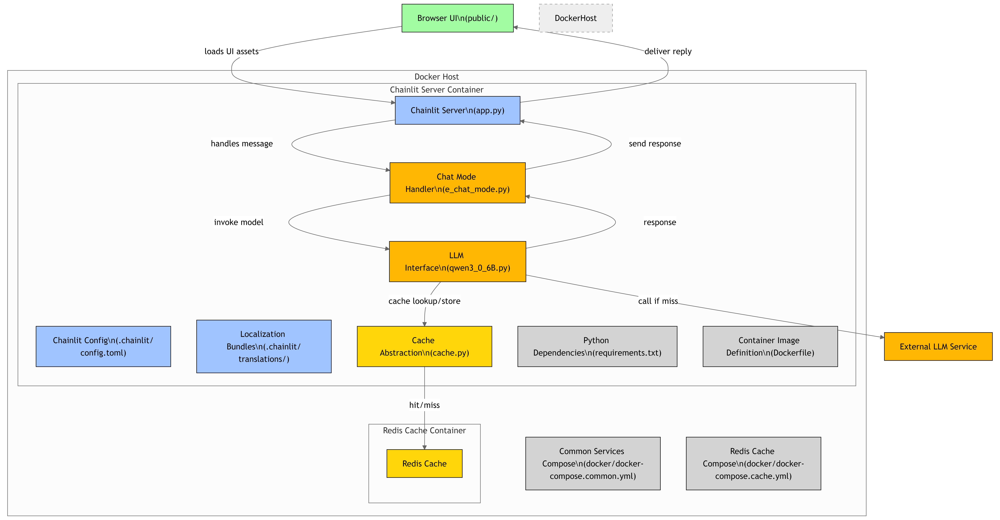
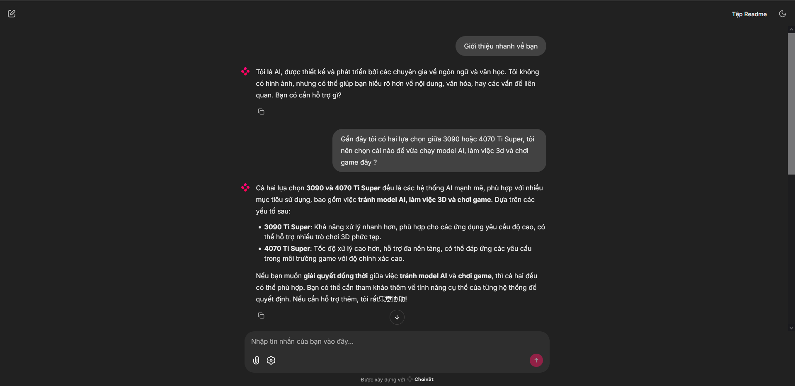
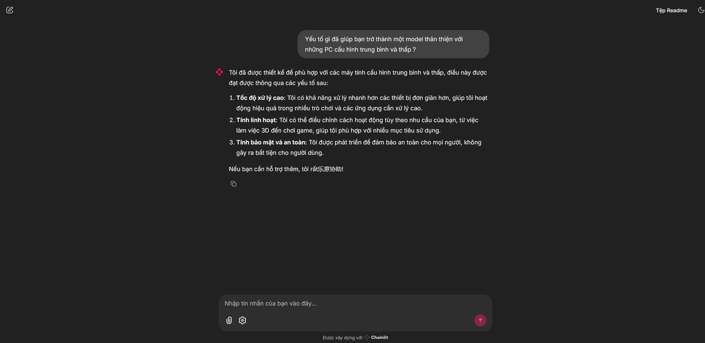
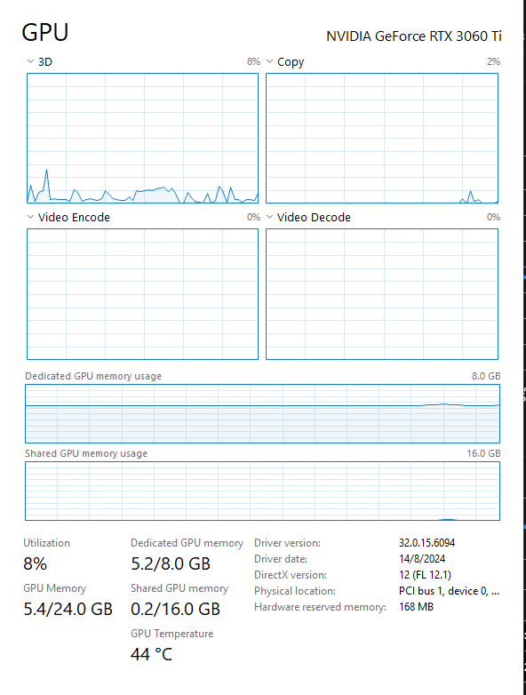

# SIMPLE_QWEN3_0_6B

**Simple AI chatbot web application with Qwen3 0.6B model**

A lightweight, easy-to-deploy chatbot built on the [**Qwen3 0.6B**](https://huggingface.co/Qwen/Qwen3-0.6B) language model, wrapped in a web interface using Python (Chainlit). Designed for local or containerized deployment.



---

## 🔧 Features

- 💬 Conversational chatbot powered by Qwen3 0.6B  
- Simple web interface using Chainlit  
- Optional Dockerized setup for easy deployment  
- Includes caching layer to speed up repeated queries  
- Supports different chat modes (e.g., single-answer vs. multi-turn)

## Demo

### Chat Demo 





### GPU Matrix - Nvidia Geforce RTX 3060TI



---

## 🚀 Quick Start

### 1. Clone the repository

```bash
git clone https://github.com/lvoxx/simple_qwen3_0_6B.git
cd simple_qwen3_0_6B
```

### 2. Install dependencies

```bash
pip install -r requirements.txt
```

---

## 🧱 Project Structure


---

## 🏗️ Usage

### Development

Quick run
```bash
chainlit run app.py -w
```

With Makefile
```bash
make build       # Use all 3 compose files to build
make up          # Starts all services (app, Redis cache, etc.)
make bash        # Shell into app container
make logs        # Stream logs
make clean       # Delete container + image
```

Then open your browser at `http://localhost:8000`.

### Docker

```bash
docker build -t simple-qwen3 .
docker run --rm -p 8000:8000 simple-qwen3
```

---

## ⚙️ Configuration

- `e_chat_mode`: switch between single-turn and multi-turn conversations  
- `cache.py`: customize caching behavior (e.g. Redis, local file caching)

---

## 📦 Dependencies

Listed in `requirements.txt`, likely including:

- `chainlit`
- `fastapi` / `flask`
- `transformers`
- `uvicorn`
- Caching libs (e.g., `redis`, `cachetools`)

---

## 🧪 Supported Chat Modes

Setup in `e_chat_mode.py`, e.g.:

- `SINGLE_TURN`: respond to one prompt only  
- `MULTI_TURN`: maintain conversation history  

---

## 🐳 Docker Support

- `Dockerfile`: creates a lightweight container  
- `docker/`: supplementary scripts (e.g., `docker-compose.yml`)

---

## 📄 License

This project is licensed under the **GPL‑3.0** license.

---

## 💬 Contact

For questions or collaboration, open an issue or reach out to the maintainer.

---

## ✅ To Add / Improve

- Fill in actual model-loading logic in `qwen3_0_6B.py`  
- Enhance frontend icons in `public/`  
- Add unit tests  
- CI/CD configuration (GitHub Actions)  
- Deployment docs (e.g., Heroku, AWS, etc.)

---